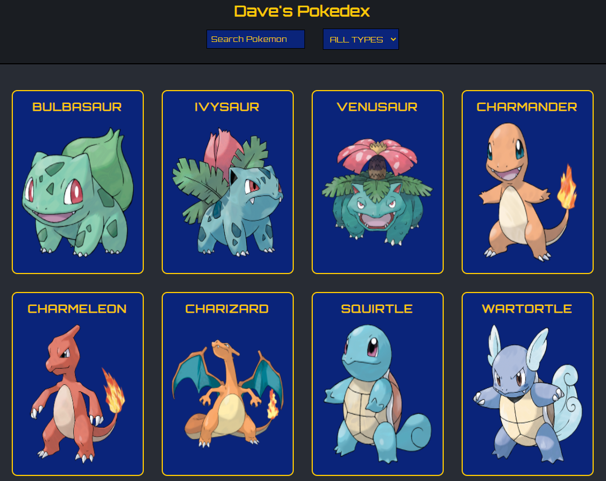

# Dave's Pokedex

When I was a kid, I was a big fan of Pokemon. So creating this simple app was like making one of my childhood dreams a reality. This was made using ReactJS, and an external 3rd party Pokemon API. It's a simple app displaying information about 151 different Pokemon. React Libraries included are: Redux for state management and Redux Sagas to manage API calls. Enjoy.

## Screenshots

